# 语音方案比对介绍  --  张睿

**语音交互**是现今应用最多的交互方式之一，特别针对车内环境，在驾驶员安心驾驶的时候，用语音可以安全的进行操控，针对我们车联网的语音需求，选用哪一家的语音方案需要进行详细的研究和比对。

##语音需求
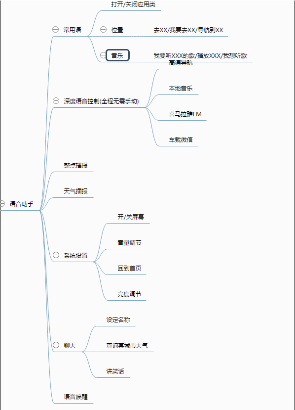

根据语音需求，选择的语音方案至少要满足**语音唤醒，语音合成，语义解析**三大基础功能
1.  **语音唤醒：**  能够通过唤醒词，唤醒语音助手，进行后续用户语义的识别，免去手动点击唤醒的操作
2.  **语音合成：**  俗称TTS(Text To Speech)，支持将文本转换成语音播报出来
3.  **语义解析：**  支持将用户输入的语音，转换成文本，并进行相应的分析，定位到相应的场景，关键字 返回结果帮助我们定位到用户需求。
例如：**"导航到深圳北站"**，除了解析语音返回整句文本之外，还需要定位到这是**地图场景**，关键字是POI点**深圳北站**

----------

## 语音方案
现今市面上比较常用的语音方案有：**腾讯云语音**，**讯飞语音**，**百度语音**，**思必驰**，**云知声**，**同行者，搜狗语音云**
- **同行者**并不同于其他只做语音方案，它提供的更多的是智能设备的整套系统方案，有对外开放SDK，但需要走商务渠道才能试用
-  **思必驰** 主要针对场景进行制定化开发，无对外开放平台进行试用，需要走商务渠道

所以暂时着重比对介绍一下**腾讯云语音**，**讯飞语音**，**百度语音**, **云知声**，**搜狗语音云**

### 讯飞语音
**优点：**
- 支持的**语义场景广泛**，包括**家居，地图，应用，音乐**等等27个场景，8个聊天对话类型
- 语义解析除了整个语句文本外，还提供详细的域名，操作，类型，关键字等**Json数据**，便于开发
- 在线功能 语义解析，语音合成，命令词识别审核通过后，可以**无限制免费使用**
- 讯飞平台可以对接**微信公众号**,在微信公众账号中增加智能问答的功能。
- 讯飞和云知声 成熟的车载案例很多

**缺点：**
- **语音唤醒**功能需要收费，最高五万套装机量授权需要 25000，更大的装机量需要定制化开发
- 唤醒词只支持4-6个汉字，无法更少
- 有些个别语义关键字，无法正确解析到，但是整句文本都能准确返回
- 免费的语音合成只支持在线，会耗费很多**流量**

> **备注：** **云知声**的对外开放平台，主要功能和使用形式同讯飞基本一致，**唤醒和离线语音合成**都需要收费定制化开发

----------

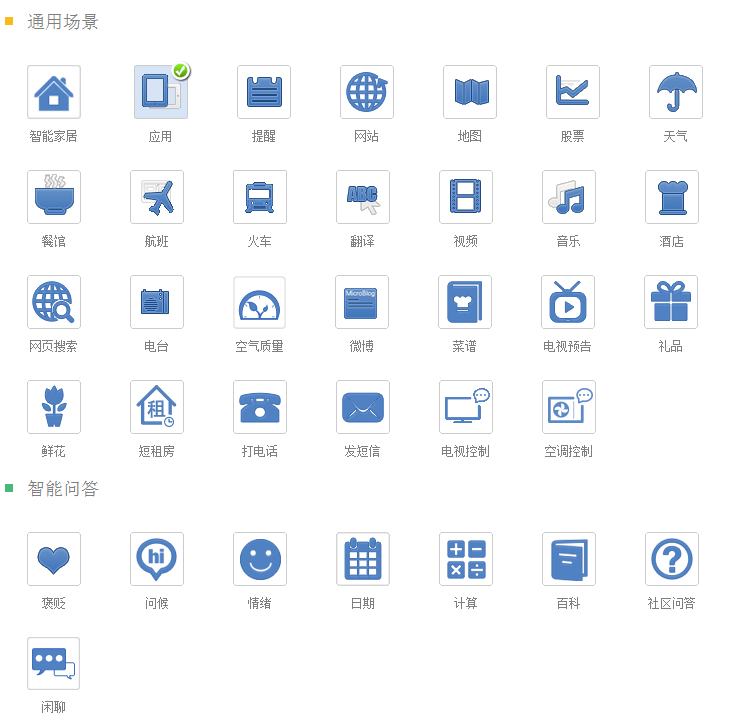
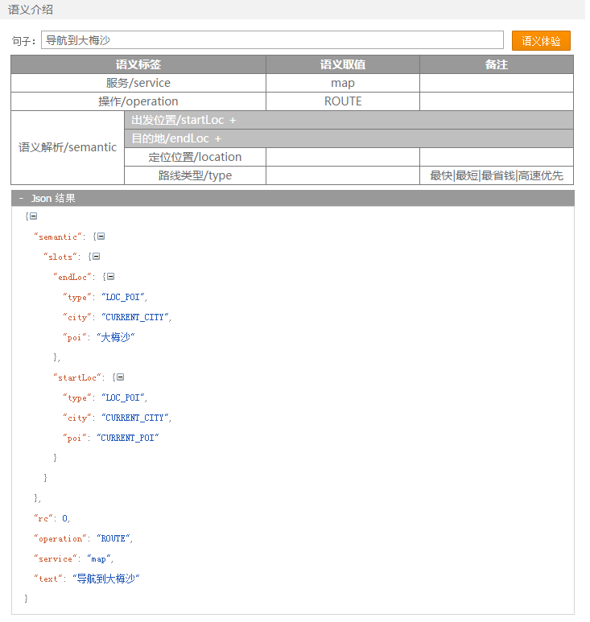
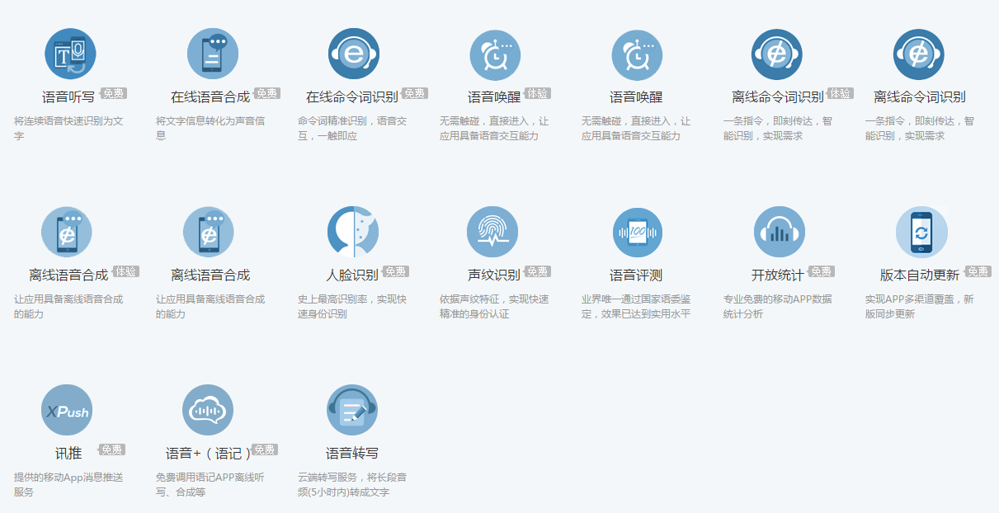

----------

### 腾讯云语音
使用腾讯云语音需要注册腾讯云账号，添加项目和服务，云语音只是整个腾讯云中的一个产品，不收费

**特点：**
- 没有提供**语音唤醒**服务
- 提供**实时流式识别，离线语音识别，语音合成**功能 
- **离线语音识别**功能 不是离线语音合成或者离线识别语音， 只是支持将录制好的音频上传 RESTful API 进行语音识别，还是需要访问在线API
- 语音识别和语音合成不是同一个SDK，语音识别是独立的Android SDK,语音合成是一个独立的 RESTful API接口
- 语音识别**成熟的客户案例少**，只有五个 没有车载行业，语音合成有一个腾讯地图
- 语音识别需要自己提供**关键字**，进行识别检索，关键字最多200个

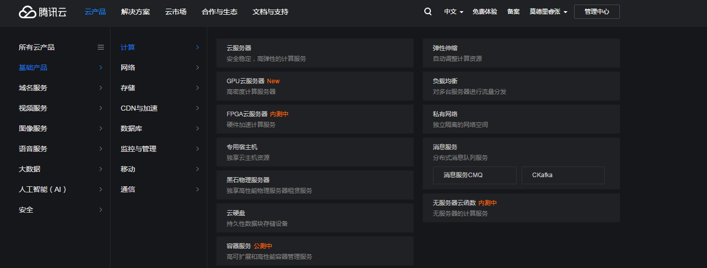

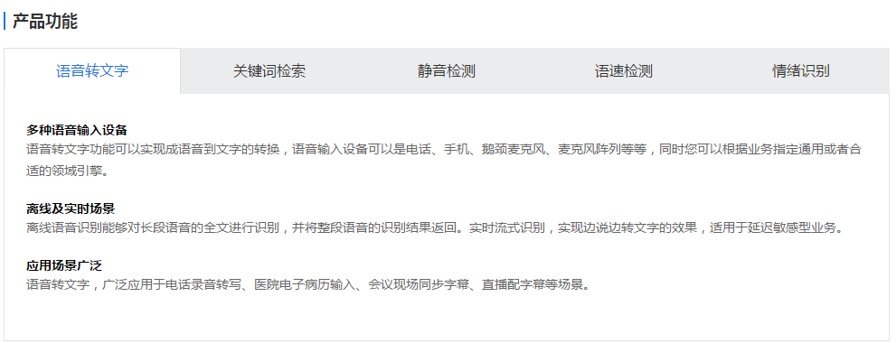

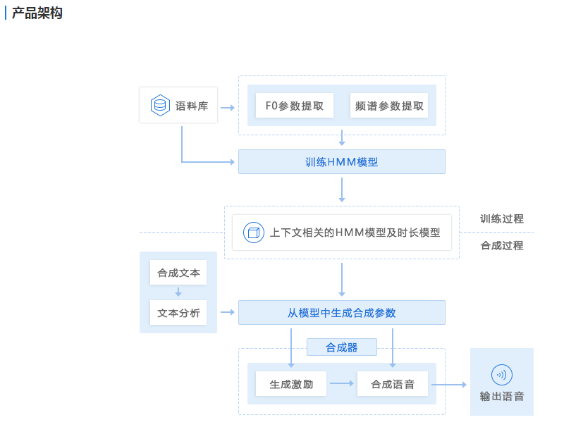

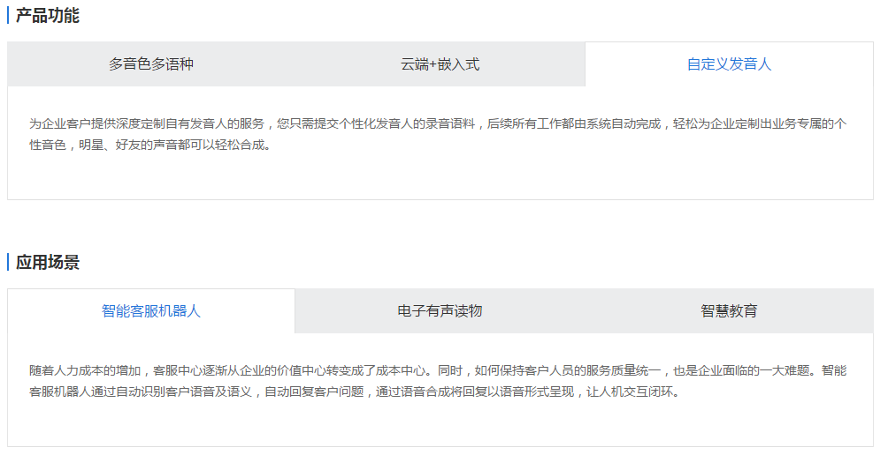

--------
### 百度语音
**特点：**
- **语音唤醒，语音识别，语音合成**三大功能基础服务**永久免费**
- **语音识别，语音合成**支持离线在线混合SDK，根据网络情况和指令进行自动切换，以及全平台的RESTful API
- **语音识别**的离线SDK支持自定义语义，在线SDK可以设置识别场景
- 支持开发者**上传词库**，用以训练识别模型
- **语音合成** 支持多语言多音色选择，可调节**语速、音调、音量、音频码率**
- **语音唤醒**最多支持十个唤醒词，包括最多三个自定义唤醒词，也叫做基础唤醒词(“小畅你好”)，剩下可选百度提供的命令唤醒词(“上一首，下一首”)

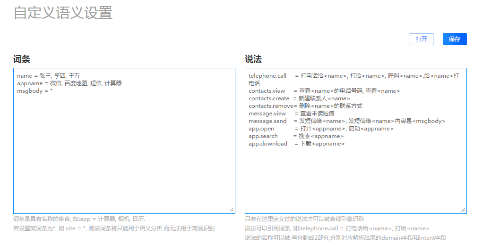
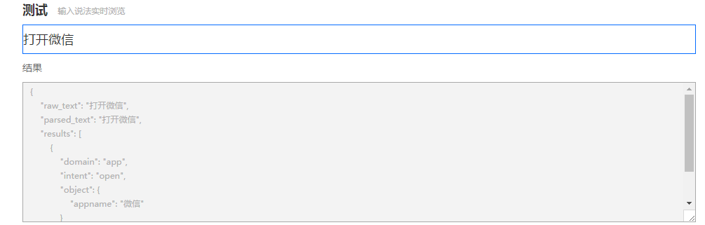
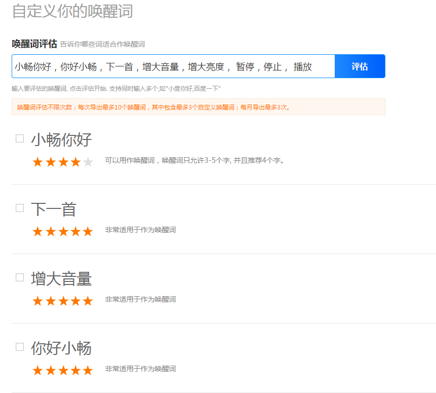

### 搜狗语音云
**特点:**
- **无语音唤醒功能**，提供三大核心功能，语音识别(离./img/在线)，音乐检索，语音合成
- **语音识别**免费提供，搜狗着重在语音识别的**准确性**，对于语义支持的不是很广泛，支持十个以内的语义场景，离线识别能通过离线的语音包，准确识别到语音
- **语音合成**，只提供离线版，但是需要走商务渠道进行合作，不免费对外开放
- **音乐检索**，可以根据音乐片段检索出整个音乐的歌曲名

## 总结
经过比对和试用SDK Demo，总体来说，百度语音最适合，，不仅能够满足我们的语音需求，还支持自定义深度优化，相比较其他语音方案，百度语音具有以下三大优势： 
1. **免费支持语音唤醒**，相对比其他方案，唤醒都是收费的，而且还能够支持最多三个自定义唤醒词
2. **提供离线语音识别和语音合成**，其他语音方案只提供在线语音合成和识别，离线都需要收费，百度语音免费提供，能够减少很大的流量消耗
3. **能够自定义语义**,我们可以根据自己的业务需求定义一些语义加入到离线识别中，做到深度化定制，给用户更好的体验，
 例如："打开路畅市场"，"退出微信互联"

